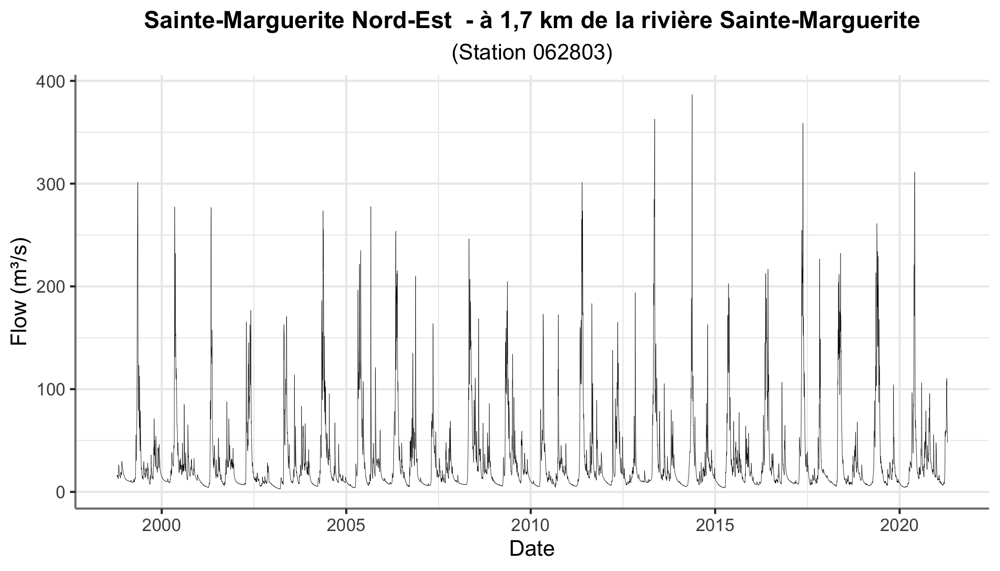
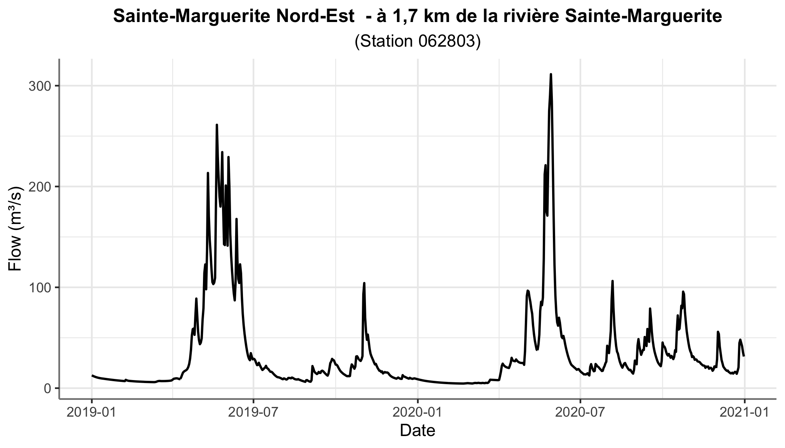
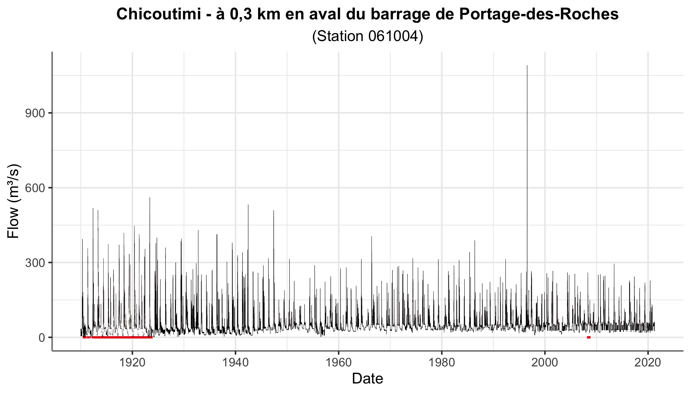
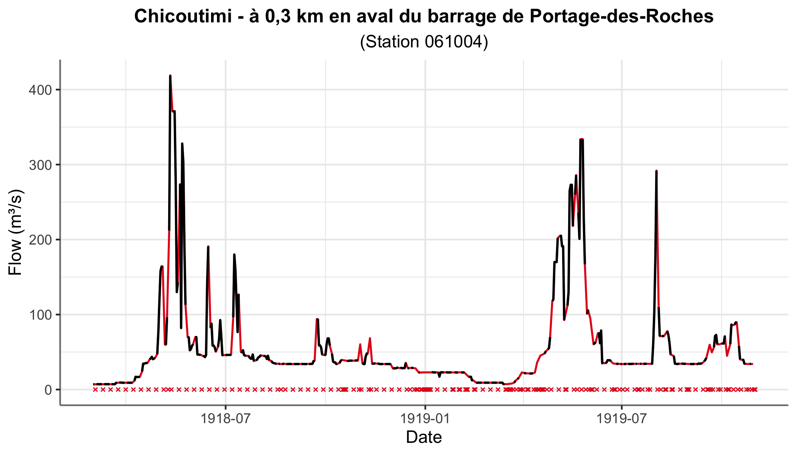
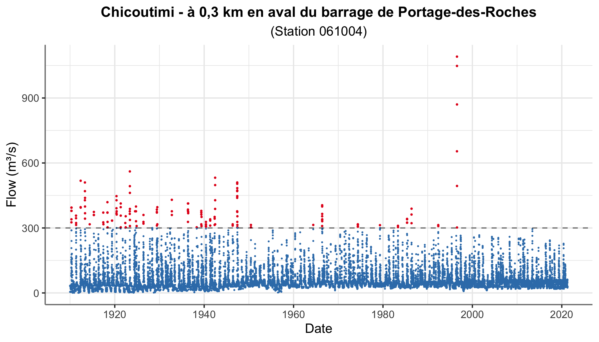
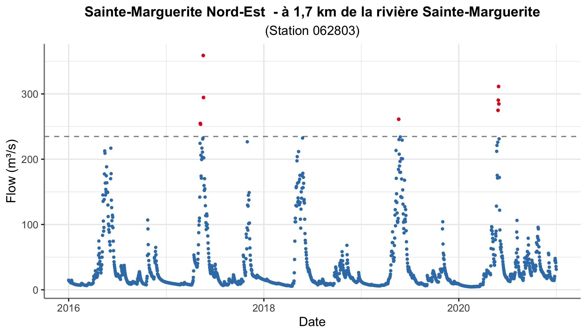

Import and visualize flow data from CHEQ 🌊
================================================================================


Files downloaded from CEHQ are messy. The header contains useful information, but this information is not well organised. The table with values appears a couple of lines below the header. In this repo, some __functions__ are written to allow importing, tidying and visualizing flow data downloaded from CEHQ website. 


Data
--------------------------------------------------------------------------------


Data consist of two stations downloaded from the [CEHQ website](https://www.cehq.gouv.qc.ca/hydrometrie/historique_donnees/default.asp).

+ `062803_Q.txt` : Station on the Sainte-Margerite river.
+ `061004_Q.txt` : Station on the Chicoutimi river.


R script
--------------------------------------------------------------------------------


All steps are performed in `main.R`. Functions are stored in `R/functions/` :

+ `read_table.R` : Function to read the data table from the downloaded file from CEHQ website.
+ `read_info.R` : Function to read the station information from the downloaded file from CEHQ website.
+ `dates.R` : Helper functions for date in `date` and `integer` format.
+ `plot_helpers.R` : Helper functions to be used with the `ggplot2` package.
+ `plot_flow_series.R` : A general function to generate nice `ggplot2` plot of the flow series.
+ `plot_flow_pot.R` : A general function to generate nice `ggplot2` plot of the peaks over threshold.


How to use ?
--------------------------------------------------------------------------------


```

# Load table.
tbl <- read_table(path)

# Load station information.
info <- read_info(path)

# Plot full series.
plot_flow_series(tbl, info)

# Plot series with NA.
plot_flow_series(tbl, info, spot.na = TRUE)

# Plot subset of the series.
plot_flow_series(tbl, info, start = "2018/01/01", end = "2020/12/13")

# Plot POT.
plot_flow_pot(tbl, info, thresh = quantile(tbl$FLOW, 0.99))

```


Results
--------------------------------------------------------------------------------

#### Full flow series of Sainte-Marguerite river




#### Subset of the flow series of Sainte-Marguerite river




#### Full flow series of Chicoutimi river with `NA`s




#### Subset of the flow series of Chicoutimi river with `NA`s




#### Peaks-over-threshold for the full Chicoutimi river flow series




#### Peaks-over-threshold for the last five years of the Sainte-Marguerite river




___Enjoy !___ ✌🏻
