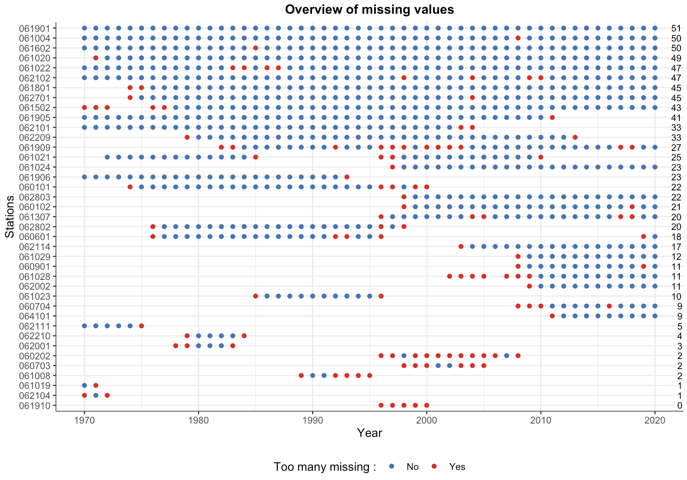

Import and visualize flow data from CHEQ 🌊
================================================================================


Files downloaded from CEHQ are messy. The header contains useful information, but this information is not well organised. The table with values appears a couple of lines below the header. In this project, I share some functions that I've written to allow importing, tidying and visualizing flow data downloaded from CEHQ website. 


Step 1 : Download data
--------------------------------------------------------------------------------

See R script `R/s1_data_download.R` for a complete example.

```
# Fetch stations.
stns <- fetch_stns(1L)  # Id of the region.

# Download stations.
download_stns_files(stns$No_de_la_station)

```

Step 2 : Import and plot data
--------------------------------------------------------------------------------

See R script `R/s2_import_and_plot_data.R` for an example.


```
# Load table.
tbl <- read_table(path)

# Load station information.
info <- read_info(path)

# Plot full series.
plot_flow_series(tbl, info)

# Plot series with NA.
plot_flow_series(tbl, info, spot.na = TRUE)

# Plot subset of the series.
plot_flow_series(tbl, info, start = "2018/01/01", end = "2020/12/13")

# Plot POT.
plot_flow_pot(tbl, info, thresh = quantile(tbl$FLOW, 0.99))

```

Step 3 : Explore missing values.
--------------------------------------------------------------------------------

See R script `R/s3_explore_missings.R` for an example.

```
# To be completed...

```

Results
--------------------------------------------------------------------------------

#### Full flow series of Sainte-Marguerite river :


#### Subset of the flow series of Sainte-Marguerite river :


#### Full flow series of Chicoutimi river with `NA`s :


#### Subset of the flow series of Chicoutimi river with `NA`s :


#### Overview of missing values :




#### Peaks-over-threshold for the full Chicoutimi river flow series : 


#### Peaks-over-threshold for the last five years of the Sainte-Marguerite river :


___Enjoy !___ ✌🏻
